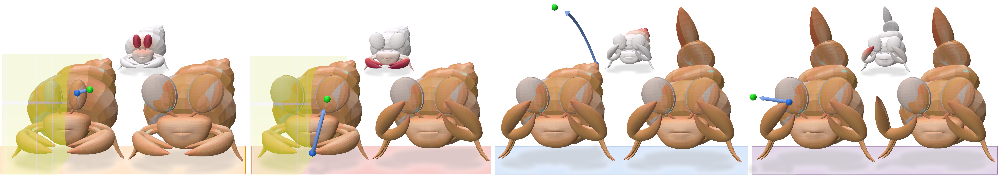
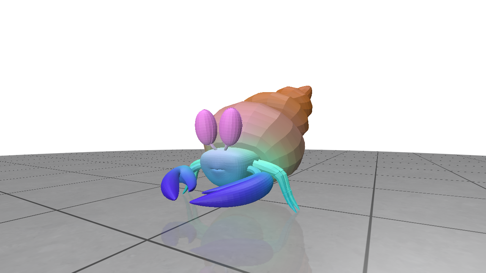
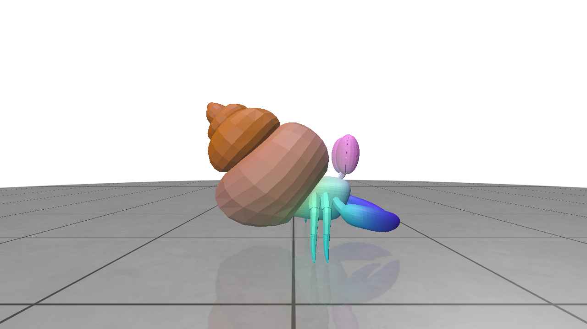

# Deep Feature Deformation Weights

<a href="https://arxiv.org/abs/2601.12527"></a>
<a href="https://threedle.github.io/dfd"></a>



Official implementation of CVPR 2026 paper "Deep Feature Deformation Weights".

## Prerequisites

- Python 3.10
- CUDA 12.8
- Node.js ≥ 18 (required only for GLB mesh simplification via `--reduction`)

### Installation

```bash
conda env create -f environment.yml
conda activate dfd
uv pip install -r requirements.txt --extra-index-url https://download.pytorch.org/whl/cu128 --prerelease=allow
uv pip install ninja
uv pip install git+https://github.com/NVlabs/nvdiffrast.git --no-build-isolation
npm install -g @gltf-transform/cli
```

`distillation.py` supports distillation for the following image models: dino2, dino3, radio, sam, sam2, clip.

The user is responsible for installing any prerequisite libraries or weights associated with use of these models. 

**Make sure to set -H, -W to an appropriate multiple of the patch size otherwise feature extraction will fail.**

SAM2 installation is also required for using sam-based feature refinement during distillation (see below).

## Barycentric Feature Distillation

You can call `barycentric_distillation()` in `distillation.py` to perform feature distillation, which distills per-pixel image features into a feature field via barycentric sampling. The script can be called directly using the example asset as follows:

```bash
python distillation.py assets/crab/crab.glb outputs/crab/dinov2_vitg14_reg --model dino2 --arch dinov2_vitg14_reg -H 518 -W 518
```

Outputs are saved to `outputs/crab/dinov2_vitg14_reg`, including the trained MLP (`final_encoder.pth`), features sampled on mesh vertices (`crab.pt`), and PCA-colored screenshots.



### Command Line Arguments
Objs with texture coordinates can be rendered with texture using the `--texturedir` kwarg.

High resolution meshes (>5m vertices) should be first downsampled before rendering by using the `--reduction` kwarg. This calls either GLTF-transform (for GLBs) or QEM decimation (other formats) under the hood. The distillation should take at most a few minutes for any choice of encoder/mesh, but for high resolution shapes the rendering can run into memory issues.

`--use_sam` will refine the render feature maps by using SAM segmentation to identify areas where patch-level features "bleed" into other parts of the shape and fix them. This will improve distilled feature quality but will increase runtime (~2 min longer).

| Argument | Default | Description |
|---|---|---|
| `--texturedir` | `None` | Path to texture image for textured OBJ rendering. GLB models will automatically have their textures extracted using trimesh. |
| `--saveto` | `vertices` | Saves output feature tensor sampled either over vertices (`vertices`) or face centroids (`faces`). |
| `--no_cache` | `False` | Skip writing cached intermediates to disk (saves disk space). |
| `--reduction` | `0` | Fraction of edges to collapse for mesh simplification before processing. |
| `--viewradius` | `2.8` | Camera distance from the mesh center when sampling views. |

**Image model parameters**

| Argument | Default | Description |
|---|---|---|
| `--model` | `dino2` | Feature extractor: `dino2`, `dino3`, `clip`, `sam`, `sam2`, `radio`. |
| `--arch` | `None` | Architecture name for the model (e.g. `dinov2_vitg14_reg`). |
| `--checkpoint` | `None` | Path to local model checkpoint weights. |
| `--repodir` | `None` | Path to local repository source for the model. |
| `--model_cfg` | `None` | Path to model config file (only relevant for `sam2`). |
| `--sam2_hr` | `False` | Concatenate high-resolution SAM2 features. |

**Training parameters**

| Argument | Default | Description |
|---|---|---|
| `-H` / `--imgh` | `512` | Render image height. Must be a multiple of the model's patch size. |
| `-W` / `--imgw` | `512` | Render image width. Must be a multiple of the model's patch size. |
| `--nviews` | `24` | Total views to render (should be a multiple of 3 for default viewtype). |
| `--viewtype` | `default` | View sampling strategy: `default` or `fib` (fibonacci). |
| `--batchsize` | `10000` | Number of (flattened) training points sampled per MLP optimization step. |
| `--subsetepoch` | `0.1` | Fraction of all training points to randomly sample per epoch. Set to `0` to use the full training set every epoch. |
| `--viewbatchsize` | `16` | Number of views to batch for rendering. |
| `--featurebatchsize` | `2` | Number of views to batch for feature extraction. |
| `--lr` | `1e-3` | Learning rate. |
| `--iters` | `20` | Training iterations/epochs. |

**Gaussian blurring**

| Argument | Default | Description |
|---|---|---|
| `--noiseradius` | `0.05` | Maximum radius for sampling noisy positions about each training position. |
| `--noisen` | `0` | Number of noise samples per position sample (disabled by default). |

**SAM feature reassignment**

| Argument | Default | Description |
|---|---|---|
| `--use_sam` | `0` | If > 0, uses SAM masks to refine per-pixel features and reduce feature bleeding. Value determines the outlier threshold (L2 distance). Value of 1 is recommended. |

**MLP parameters**

| Argument | Default | Description |
|---|---|---|
| `--nlayers` | `4` | Number of MLP layers. |
| `--width` | `256` | Hidden layer width. |
| `--positional_encoding` | `False` | Use Fourier features for positional encoding. |
| `--sigma` | `5.0` | Sigma for Fourier features. |

## Interactive Deformation GUI

`interactive_affine.py` launches a [Polyscope](https://polyscope.run/)-based GUI for real-time handle-based mesh deformation using the distilled feature weights.

Click anywhere on the mesh to place a handle and visualize its influence weights over the surface. Then use the translation, rotation, and scale sliders to deform the mesh.

### Capabilities

<table>
<tr>
<td align="center"><video src="https://github.com/user-attachments/assets/1aa412b5-566d-42e5-8b77-c9eed976e91a" width="100%"></video>Mesh with topological defects.</td>
<td align="center"><video src="https://github.com/user-attachments/assets/ff1c21c2-1b88-4c46-b633-26083ca4e4e6" width="100%"></video>Symmetry, feature anchors, locality weighting.</td>
</tr>
</table>

### Example

Run the interactive GUI using the weights distilled above:

```bash
python interactive_affine.py assets/crab/crab.glb --weightsdir outputs/crab/dinov2_vitg14_reg/final_encoder.pth
```

## Citation

```bibtex
@InProceedings{DFD_Liu_2026_CVPR,
      author = {Liu, Richard and Lang, Itai and Hanocka, Rana},
      title = {Deep Feature Deformation Weights},
      booktitle = {Proceedings of the IEEE/CVF Conference on Computer Vision and Pattern Recognition (CVPR)},
      month = {June},
      year = {2026}
    }
```
